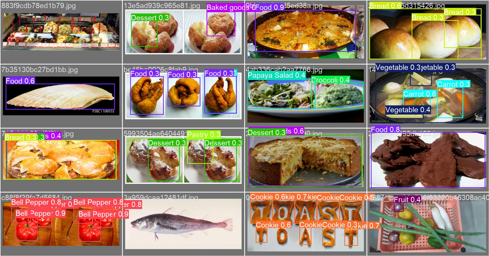
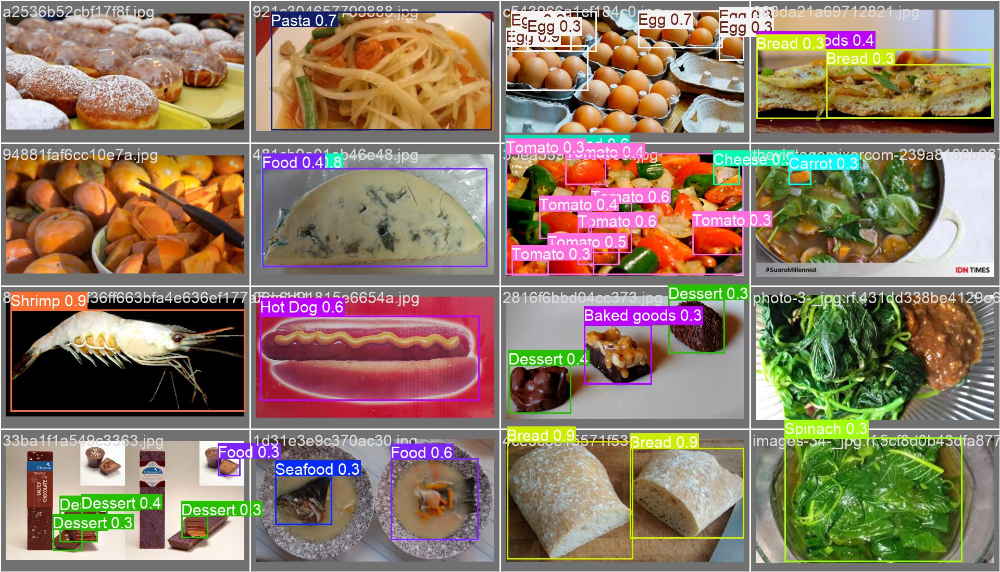
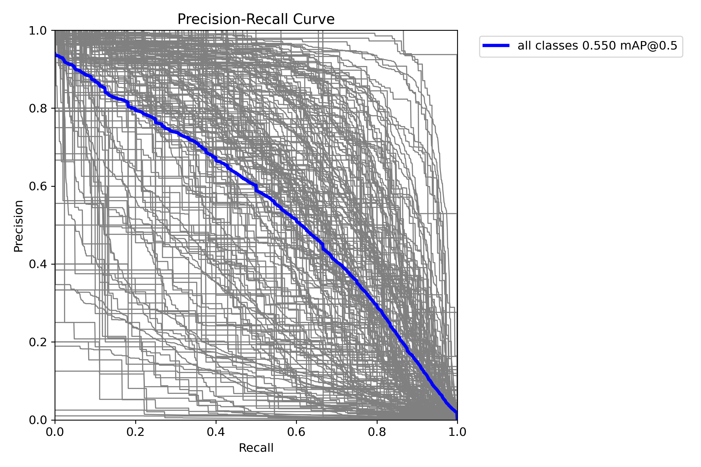
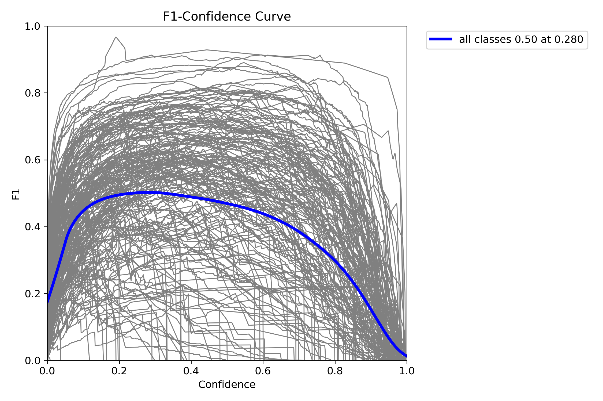
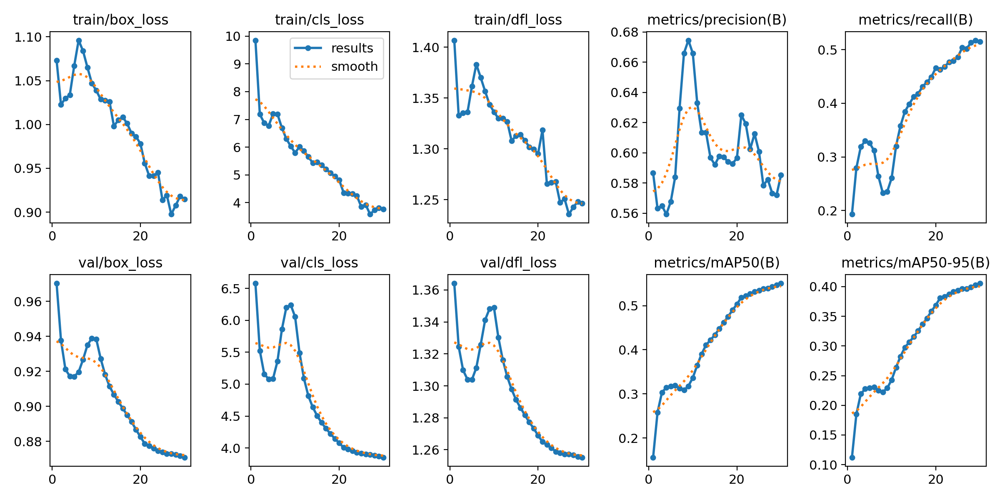

<h1 align="center">🍽️ CalCore Pipeline</h1>

<p align="center">
  <b>Commercial-grade food recognition · weight estimation · nutrition analysis</b><br/>
  <i>Snap a photo. Get instant macros. No manual logging, no guessing.</i>
</p>

<p align="center">
  <a href="https://python.org"></a>
  <a href="https://fastapi.tiangolo.com"></a>
  <a href="https://pytorch.org"></a>
  <a href="https://developer.nvidia.com/cuda-toolkit"></a>
  
</p>

<p align="center">
  <a href="#-quick-start">Quick Start</a> ·
  <a href="#-pipeline-architecture">Architecture</a> ·
  <a href="#-model-accuracy">Accuracy</a> ·
  <a href="#-api-usage">API</a> ·
  <a href="#%EF%B8%8F-configuration">Config</a> ·
  <a href="SETUP.md">Full Setup Guide</a>
</p>

---

## What It Does

Point a camera at any meal — the pipeline detects every food item, segments it from the background, classifies it, estimates its real-world volume from depth, and returns weight + full nutrition.

| Input | Output |
|-------|--------|
| Any JPEG / PNG food photo | Food name, weight (g), calories, protein, fat, carbs per item |
| Up to 3 images per request | Aggregated totals across all images |
| Optional reference object | Calibrated depth scale for higher accuracy |

---

## 🔬 Pipeline Architecture

Six specialised models chained together — each stage feeds the next:

| Stage | Model | What it does |
|-------|-------|--------------|
| **1. Detect** | YOLOv8l — 205 food classes | Draws a bounding box around every food item |
| **2. Segment** | FastSAM | Generates a pixel-precise mask per detection |
| **3. Classify** | EfficientNetV2-L + CLIP fallback | Names the exact food from the masked crop |
| **4. Depth** | Depth Anything V2 Metric (ViT-L) | Per-pixel depth map in real centimetres |
| **5. Volume** | Voxelisation + USDA correction | Integrates depth × mask → 3D volume |
| **6. Nutrition** | USDA FoodData Central + offline cache | Weight → calories, protein, fat, carbs |

> **Dual classifier:** EfficientNet (90% accuracy, 101 classes) is primary. If confidence < 65%, CLIP zero-shot takes over — covering regional dishes, garnishes, and anything outside the training set.

---

## 📊 Model Accuracy

### Detector — YOLOv8l

Trained on **113,884 images** across **205 food classes** (4 combined datasets, 30 epochs).

| Metric | Score |
|--------|-------|
| **mAP@50** | **0.551** |
| **mAP@50-95** | **0.405** |
| Precision | 0.585 |
| Recall | 0.515 |

### Classifier — EfficientNetV2-L

Fine-tuned on **Food-101** — 101,000 images, 101 classes, 25 epochs.

| Metric | Score |
|--------|-------|
| **Validation accuracy** | **90.02%** |
| Training time | ~61 min / epoch on RTX 4060 |

---

## 🎯 Detection Samples

Validation predictions from the trained YOLOv8l detector:





<table>
<tr>
<td><br/><sub>PR Curve</sub></td>
<td><br/><sub>F1 Curve</sub></td>
<td><br/><sub>Training Curves</sub></td>
</tr>
</table>

---

## 📦 API Usage

Start the server:

```bash
uvicorn api_server:app --host 0.0.0.0 --port 8000
```

**Single image:**

```bash
curl -X POST http://localhost:8000/analyze \
  -F "file=@your_meal.jpg"
```

**Multiple images (up to 3):**

```bash
curl -X POST http://localhost:8000/analyze_multi \
  -F "files=@plate1.jpg" \
  -F "files=@plate2.jpg"
```

**Example response:**

```json
{
  "success": true,
  "count": 2,
  "total_weight_g": 465.0,
  "total_calories": 955.0,
  "food_items": [
    {
      "food_name": "pizza",
      "weight_g": 285.0,
      "confidence": 0.87,
      "nutrition": { "calories": 760, "protein_g": 32.1, "fat_g": 28.4, "carbs_g": 92.0 }
    },
    {
      "food_name": "caesar_salad",
      "weight_g": 180.0,
      "confidence": 0.79,
      "nutrition": { "calories": 195, "protein_g": 8.2, "fat_g": 14.1, "carbs_g": 10.5 }
    }
  ]
}
```

Interactive docs at **http://localhost:8000/docs**

---

## ⚡ Performance

| Hardware | Single image |
|----------|-------------|
| RTX 4060 8 GB | ~1.2 – 2.0 s |
| RTX 3080 10 GB | ~0.8 – 1.4 s |
| CPU only | ~15 – 30 s |

FP16 autocast · batched tile inference · vectorised Soft-NMS · single-call FastSAM prompting — all on by default.

---

## 🚀 Quick Start

### Requirements

- Python 3.10 or 3.11
- NVIDIA GPU with 8 GB+ VRAM (recommended)
- CUDA 12.x drivers

### 1 — Clone

```bash
git clone --recurse-submodules https://github.com/maazxo1/CalCore-Pipeline.git
cd CalCore-Pipeline
```

### 2 — Virtual environment

```bash
python -m venv venv

# Windows
venv\Scripts\activate

# Linux / macOS
source venv/bin/activate
```

### 3 — Install PyTorch

Visit [pytorch.org/get-started](https://pytorch.org/get-started/locally/) to pick the right CUDA build:

```bash
# CUDA 12.1
pip install torch==2.7.1 torchvision==0.22.1 --index-url https://download.pytorch.org/whl/cu121

# CPU only
pip install torch==2.7.1 torchvision==0.22.1
```

### 4 — Install dependencies

```bash
pip install -r requirements.txt
pip install -e Depth-Anything-V2
```

### 5 — Configure environment

```bash
cp .env.example .env
# Add your USDA_API_KEY — free signup at https://fdc.nal.usda.gov/api-key-signup
```

### 6 — Download model weights

**Our pre-trained weights** (one command — no training needed):

```bash
python scripts/download_weights.py
```

| File | Size | Info |
|------|------|------|
| `weights/yolo.pt` | ~84 MB | YOLOv8l — 205-class food detector |
| `weights/efficientnet_food101/best.pth` | ~451 MB | EfficientNetV2-L — 90.02% val accuracy |

**Third-party weights** (download manually — not ours to redistribute):

| File | Source |
|------|--------|
| `weights/FastSAM.pt` | [Ultralytics Assets](https://github.com/ultralytics/assets/releases) |
| `weights/depth_anything_v2_metric_hypersim_vitl.pth` | [Depth-Anything-V2 Releases](https://github.com/DepthAnything/Depth-Anything-V2/releases) |
| `weights/depth_anything_v2_large.pth` | [Depth-Anything-V2 Releases](https://github.com/DepthAnything/Depth-Anything-V2/releases) *(optional fallback)* |

> **Graceful degradation** — missing `yolo.pt` falls back to pretrained YOLOv8l · missing efficientnet uses CLIP · missing metric depth uses relative depth.

### 7 — Run

```bash
# CLI — single image
python main.py samples/food.jpg

# API server
uvicorn api_server:app --host 0.0.0.0 --port 8000
```

---

## ⚙️ Configuration

All settings live in `.env`. Defaults are tuned for RTX 4060 8 GB.

| Variable | Default | Description |
|----------|---------|-------------|
| `USDA_API_KEY` | — | Live USDA nutrition lookup |
| `CLASSIFIER_BACKEND` | `auto` | `auto` · `efficientnet` · `clip` |
| `GPU_CONCURRENCY` | `1` | Concurrent GPU requests |
| `YOLO_CONF` | `0.10` | Detection confidence threshold |
| `FASTSAM_IMGSZ` | `640` | Segmentation input size |
| `EFFNET_FALLBACK_THRESHOLD` | `0.65` | EfficientNet → CLIP fallback threshold |

See [.env.example](.env.example) for the full list.

---

## 🗂️ Project Structure

```
CalCore-Pipeline/
├── main.py                        ← CLI pipeline entry point
├── api_server.py                  ← FastAPI server
├── core/
│   ├── food_detector.py           ← YOLOv8l (tiled + batched inference)
│   ├── segment_food.py            ← FastSAM (batch prompt)
│   ├── classify.py                ← CLIP classifier
│   ├── classify_efficientnet.py   ← EfficientNetV2-L (primary)
│   ├── estimate_depth.py          ← Depth Anything V2 + FP16
│   ├── volume_calculator.py       ← Mask × depth → volume
│   ├── volume_estimator.py        ← USDA-corrected weight
│   ├── weight_guardrails.py       ← Per-food weight bounds
│   └── pipeline_postprocess.py   ← Deduplication + filtering
├── data/
│   ├── food_taxonomy.json         ← 128-entry food database
│   └── usda_nutrition_lookup.py  ← Offline nutrition cache
├── scripts/
│   ├── download_weights.py        ← Pull pre-trained weights from release
│   └── train_efficientnet_food101.py
├── Depth-Anything-V2/             ← Depth model (git submodule)
├── weights/                       ← Model weights (gitignored — download above)
├── requirements.txt
└── .env.example
```

---

<p align="center">
  Built with&nbsp;
  <a href="https://github.com/ultralytics/ultralytics">YOLOv8</a> ·
  <a href="https://github.com/CASIA-IVA-Lab/FastSAM">FastSAM</a> ·
  <a href="https://github.com/huggingface/pytorch-image-models">EfficientNet</a> ·
  <a href="https://openai.com/research/clip">CLIP</a> ·
  <a href="https://github.com/DepthAnything/Depth-Anything-V2">Depth Anything V2</a> ·
  <a href="https://fdc.nal.usda.gov">USDA FoodData Central</a>
</p>
